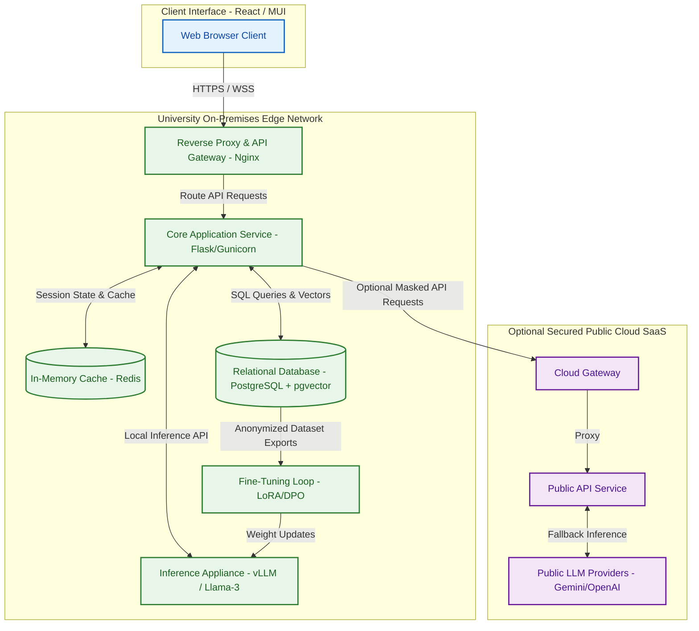
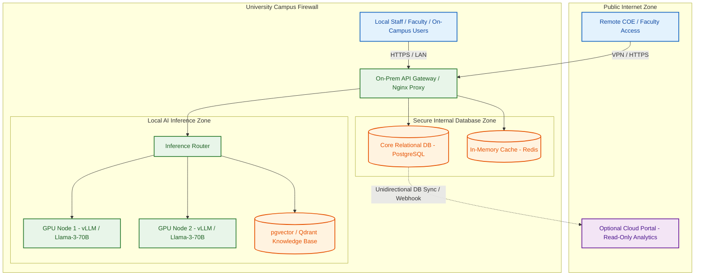
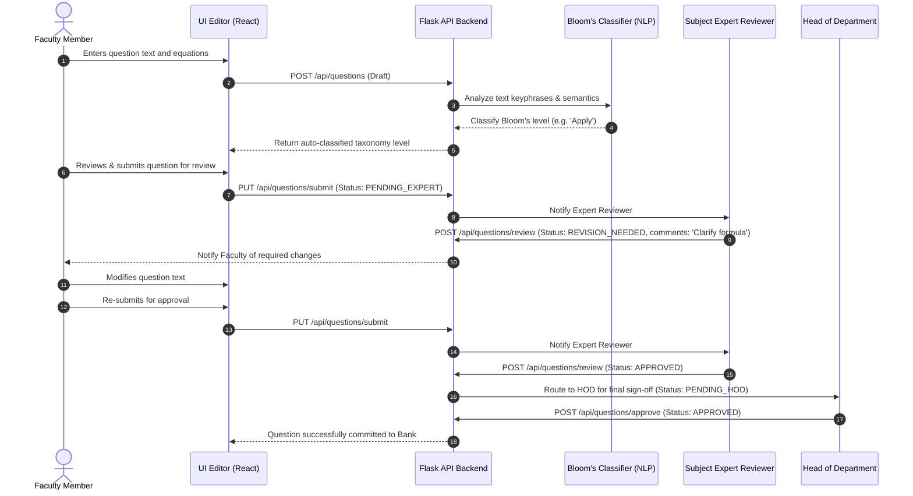
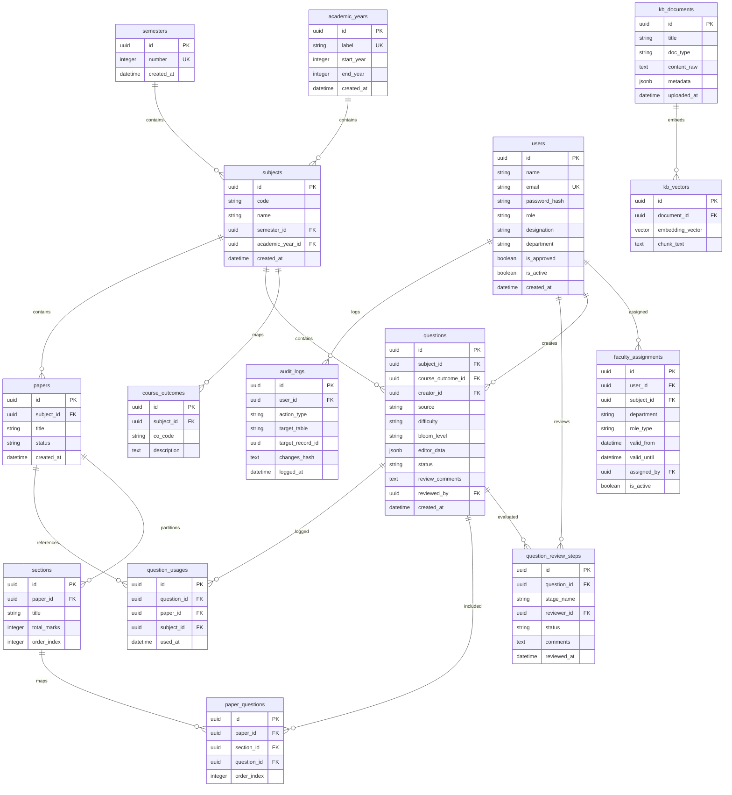
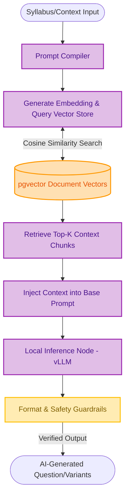

# Product Requirements Document (PRD)
## Asteriq Papers: The AI-Powered Exam Lifecycle Operating System

> **Document Version:** 1.4.0  
> **Status:** Scoped Executive Specification  
> **Author:** Muzammil Muzaffar  
> **Date:** July 14, 2026  

---

## Strategic Foundations & Architectural Policies

The Asteriq Papers platform is built upon three baseline design decisions that align system capabilities with the operational constraints and data privacy requirements of higher education institutions:

1. **Modular Accreditation Mapping & Internationalization:**
   - *Baseline Configuration:* The primary configuration supports South Asian standards, specifically the **NBA (National Board of Accreditation)** and **NAAC (National Assessment and Accreditation Council)**.
   - *Design Rationale:* Asteriq Papers decouples core academic logging and question metadata from accreditation assessment rules. This modular architecture allows institutions to support international accreditation standards (such as **ABET, QAA, ECTS, AACSB**) through configuration changes and pluggable metadata adapters, without requiring core database migrations or code modifications.
2. **Configurable Legacy ERP Sync Pipeline:**
   - *Baseline Configuration:* Rather than imposing a single synchronization methodology, Asteriq Papers adapts to the infrastructure maturity of each partner university.
   - *Design Rationale:* The integration layer supports a broad range of sync interfaces: **REST APIs, GraphQL endpoints, webhook triggers, direct database connectors, asynchronous ETL batch schedules, and manual CSV/Excel file uploads** to ingest subjects, student lists, and faculty mappings. Sync frequency and throughput metrics are fully configurable per tenant.
3. **On-Prem First Infrastructure & Hardware Agnosticism:**
   - *Baseline Configuration:* Asteriq Papers is designed from inception to run in an on-premises configuration. All AI inference (item writing, Bloom classification), vector indexes (past papers, syllabi), and operational services execute within the institution's private physical or virtualized infrastructure.
   - *Design Rationale:* Cloud deployments are available as an optional hosted alternative. The runtime is containerized and hardware-agnostic, dynamically adjusting batch sizes, caching models, and model quantization parameters (FP16 down to INT4) to optimize execution on any target from single-GPU workstations to high-performance enterprise GPU clusters.

---

## Section 1: The Core Vision & Foundation

### Strategic Reframing (Asteriq Platform & Asteriq Papers)
The higher education sector is plagued by fragmented legacy systems—siloed ERPs, isolated Learning Management Systems (LMS), and manual administrative workflows—none of which natively incorporate intelligent automation. 

While **Asteriq** represents the long-term platform vision for a unified AI operating system for universities, **Asteriq Papers** is the first module being designed, implemented, audited, and deployed. It acts as the product suite's beachhead.

Asteriq Papers automates the entire exam lifecycle, covering syllabus-compliant, balanced, and secure question paper generation, peer review, and distribution:

```
+-----------------------------------------------------------------------------------+
|                               ASTERIQ PAPERS                                      |
+-----------------------------------------------------------------------------------+
|  [Blueprint Composer]   [LaTeX Math Editor]   [Review Workflows]   [Secure Export] |
+-----------------------------------------------------------------------------------+
|            Syllabus RAG Vector Store  |  On-Prem Local LLM (vLLM)                 |
+-----------------------------------------------------------------------------------+
```

### Sovereignty & On-Prem First Foundation
Academic data is highly sensitive, containing intellectual property (exam questions, research) and protected personal information (student grades, demographic data). Relying on external cloud LLM providers introduces compliance risks (GDPR, FERPA), variable API costs, and data-leak vulnerabilities.

Asteriq Papers enforces a strict **On-Prem First architecture** from Day One. All exam contents, drafts, history, and syllabus inputs remain within the university's own physical or private virtualized infrastructure by default. AI inference, document processing, vector databases, and retrieval systems operate locally unless a university explicitly chooses a hybrid or cloud deployment.

#### Evolution and Optimization Roadmap
Rather than following a multi-year migration roadmap, the platform remains on-premise from day one and continuously evolves through regular software updates and performance optimizations. Future improvements—such as enhancements to AI models, inference performance, RAG pipelines, vector retrieval, OCR, workflow automation, and reasoning quality—are delivered seamlessly without requiring architectural migration.

Institutional intelligence primarily improves through:
- **Retrieval-Augmented Generation (RAG)** indexing local syllabus files, course goals, and historical exam structures.
- **Local Vector Databases & Knowledge Bases** acting as the primary source of truth.
- **Faculty Feedback & Local LoRA Adapters** to adjust stylistic or subject-specific nuances.
- **Local Preference Optimization** to align outputs with grading standards.

By keeping institutional knowledge decoupled from the underlying base LLM, universities can easily adopt newer, more powerful open-weight models as they are released without losing their accumulated institutional intelligence.

---

## Section 2: Users, Stakeholders, and Journeys

### User Personas
The system segments user interactions into five granular roles:

*   **Super Admin (IT Infrastructure Owner):**
    - *Profile:* Head of Institutional IT.
    - *Needs:* Direct control over SSO integrations, system audit logs, API rate limiting, local LLM node health, and multi-tenant database partitioning.
    - *KPIs:* System uptime (>99.99%), SSO sync latency (<200ms), hardware utilization efficiency.
*   **Controller of Examinations (COE):**
    - *Profile:* Institutional Exam Director.
    - *Needs:* Absolute document security, leak prevention, auditability of paper compilation, and cryptographic verification of distributed exam packets.
    - *KPIs:* Zero exam leaks, 100% compliance with exam blueprints, publication timeline adherence.
*   **Head of Department (HOD):**
    - *Profile:* Academic Department Chair.
    - *Needs:* Dashboard tracking syllabus coverage, faculty review progress, question bank health, and accreditation mapping compliance.
    - *KPIs:* Syllabus-to-exam coverage ratio (100%), average review turnaround time (<48 hours).
*   **Faculty (Item Writers / Reviewers):**
    - *Profile:* Professors and Instructors.
    - *Needs:* Intuitive LaTeX mathematical editing, AI-assisted question generation, draft recovery, and seamless peer-review collaboration.
    - *KPIs:* Question rejection rates (<5%), time spent writing papers, quality score of generated questions.
*   **IT Administrator (On-Prem / Edge Operator):**
    - *Profile:* Systems Engineer.
    - *Needs:* Setup tools for local LLM inference engines, database backups, K8s cluster status, and local model updates.
    - *KPIs:* Model inference latency (<50ms/token), VRAM utilization rate, backup recovery speed.

### Stakeholders Matrix
| Stakeholder | Category | Primary KPI | Operational Interest |
| :--- | :--- | :--- | :--- |
| **University Trustees / Board** | Primary | Institutional Brand Value & Revenue | Budget optimization, full on-premise data sovereignty, regulatory standing. |
| **COE Office** | Primary | Exam Execution Integrity | End-to-end security, encryption keys, print-ready PDF compilers. |
| **Faculty Senate** | Secondary | Workload Balance & Usability | Editor stability, draft recovery, reduction in exam-prep overhead. |
| **Regulatory Bodies (NBA/NAAC)**| Tertiary | Compliance Score / Accreditation Status | Clear linkage between course outcomes (CO), program outcomes (PO), and exam questions. |

### End-to-End User Journey: The Exam Lifecycle
1.  **Syllabus Mapping:** The HOD defines the subject syllabus, linking course units to specific **Course Outcomes (CO)** and **Program Outcomes (PO)**.
2.  **Item Writing & Creation:** A Faculty member logs in and uses the rich-text editor (with MathJax support) to write a question.
3.  **AI Bloom's Classification:** Upon typing, the local NLP service analyzes keyphrases and assigns a Bloom's Taxonomy cognitive level (e.g., *Analyze* or *Remember*).
4.  **Peer Review Routing:** The question is submitted to a Subject Expert. If changes are needed, comments are logged in a structured review trail.
5.  **HOD Sign-Off:** Once approved by the expert, the HOD reviews the item's alignment with Course Outcomes and signs off. The item is saved to the secure **Question Bank**.
6.  **Blueprint-Driven Composition:** The COE or designated Admin configures a paper blueprint (e.g., 30% Easy, 50% Medium, 20% Hard; balanced mark distribution across units). The system auto-compiles draft papers from the approved Question Bank.
7.  **Real-Time Analytics Check:** The UI's blueprint side-panel tracks marks accumulation, difficulty ratios, and CO coverage in real time.
8.  **Cryptographic Locking & Export:** Once verified, the paper is locked. The backend generates a secure PDF, an editable Word document, and a compileable LaTeX package. These files are encrypted using AES-256 and signed with the COE's private PG/SSH key.
9.  **Secure Distribution:** On exam day, the decrypted PDF is sent to regional print centers.
10. **Outcome Evaluation:** Graded exam metrics are logged. The student's performance is mapped back to the COs, providing data for accreditation reporting.

---

## Section 3: Functional Requirements

### Asteriq Papers (QPDS)
- **Real-Time Blueprint Validation:** The system must automatically analyze the question paper layout during composition. It must enforce constraints on total marks, difficulty ratios (Easy, Medium, Hard), unit distribution, and complete Course Outcome (CO) coverage.
- **Advanced LaTeX/MathML Integration:** The rich text editor must render complex mathematical, chemical, and physical formulas instantly. It must support inline LaTeX notation (e.g., `\( E=mc^2 \)`) and block display equations (e.g., `\[ \int_a^b f(x) dx \]`) with auto-compiling preview cards using MathJax v3.
- **Debounced Draft Recovery Engine:** To prevent data loss during network disruptions, the editor must execute a local auto-save routine. Changes are debounced by 3000ms and written to `localStorage` under `asteriq_draft_[question_id]`. If the session drops, the system must display a restore banner on reload.
- **AI-Driven Item Writer:** The system must interface with a local LLM server to provide faculty with question generation suggestions based on syllabus text, difficulty targets, and Bloom's cognitive taxonomy levels.
- **Syllabus RAG Vector Store:** The system must maintain a local vector store (using `pgvector`) loaded with syllabus documentation, unit breakdowns, and historic exam structures to enable context-sensitive RAG prompts during AI-assisted question generation.

---

## Section 4: Non-Functional Requirements (NFR)

### Performance
- **API Latency:** 95% of REST API requests must respond in under 150ms. RAG vector queries must return initial tokens within 800ms.
- **Concurrent User Scaling:** The system must support at least 5,000 concurrent active users during peak exam composition windows.
- **Equation Rendering Speed:** MathJax LaTeX compilation must execute on the client side in under 200ms for standard documents.
- **Inference Latency (Local LLM):** Local LLM inference engines must achieve a minimum throughput of 35 tokens per second per stream.

### Scalability
- **Database Partitioning:** Multi-tenant schemas must partition transaction logs, question banks, and audit trails by Academic Year and Department.
- **Caching Layer:** Redis must cache session states, metadata lookup responses, and compiled math blocks, reducing database queries by 60% for repetitive views.
- **Horizontal Pod Autoscaling (HPA):** Kubernetes clusters must auto-scale the backend API pods from 2 to 20 instances based on CPU utilization exceeding 70% or memory utilization exceeding 80%.

### Security, Compliance & Privacy
- **FERPA & GDPR Compliance:** Academic records and exam details must be encrypted at rest (using AES-256-GCM) and in transit (via TLS 1.3). PII fields must be masked, and the system must support data erasure ("Right to be Forgotten") for non-essential user records.
- **BOLA & IDOR Prevention:** The backend must execute role-based access checks at the resource level (e.g., verifying that a faculty member is assigned to a subject before permitting changes to its question bank).
- **Audit Trails:** All structural changes (question approval, blueprint modifications, encryption key rotations) must be recorded in an append-only audit table. This log must contain timestamped, signed cryptographic hashes of the changed states.

### Resiliency
- **Recovery Time Objective (RTO):** The target system recovery time after a critical outage is less than 30 minutes.
- **Recovery Point Objective (RPO):** The target maximum data loss window is less than 5 minutes, supported by real-time database replication and write-ahead log shipping.
- **Local Fallback Mode:** If the connection to the primary local inference engine is disrupted, the system must route requests to backup local LLM instances or, if authorized by configuration, secure cloud fallbacks within 5 seconds.

---

## Section 5: User Stories & Acceptance Criteria

### User Story 1: AI-Generated Balanced Paper Blueprint
*As a Controller of Examinations (COE),*  
*I want the AI engine to generate a balanced question paper blueprint based on syllabus units, difficulty metrics, and course outcomes,*  
*So that I can ensure academic compliance and test validity without manual mapping errors.*

```gherkin
Scenario: AI Blueprint Compilation succeeds under valid constraints
  Given the COE has loaded the blueprint configuration interface for subject "CS502 - Computer Networks"
  And the subject has 5 defined syllabus units and 6 registered Course Outcomes (CO1 to CO6)
  When the COE sets the target paper marks to 100
  And selects a difficulty split of "30% Easy, 50% Medium, 20% Hard"
  And triggers "Compile AI Draft"
  Then the system queries the Question Bank database
  And compiles a paper draft containing sections matching the targeted difficulty ratios exactly
  And validates that every course outcome (CO1 to CO6) is mapped to at least one question
  And transitions the Paper status to "DRAFT_COMPILED"
```

### User Story 2: HOD Peer-Review and Delegation Flow
*As a Head of Department (HOD),*  
*I want to delegate a draft question paper review task to a subject expert and sign off on their feedback,*  
*So that I can maintain department-wide quality control before papers are sent to the COE.*

```gherkin
Scenario: HOD delegates review and signs off after approval
  Given HOD "Dr. Sarah" is logged into the Department Dashboard
  And a draft question paper for "CS502" has been compiled and is in "PENDING_REVIEW" state
  When the HOD selects "Professor Alan" from the expert dropdown
  And clicks "Delegate Review"
  Then the system creates a new record in the "question_review_steps" table with status "PENDING"
  And notifies Professor Alan via his dashboard feed
  When Professor Alan submits approval with comments "Syllabus mapping looks correct"
  Then the review step status updates to "APPROVED"
  And the paper status updates to "PENDING_HOD_SIGN_OFF"
  When the HOD reviews the comments and signs off
  Then the paper is locked and moves to "APPROVED_BY_DEPT"
```

### User Story 3: Local LLM Overload triggers Optional Cloud Fallback
*As an IT Administrator,*  
*I want the system to automatically redirect request overflows to a secure cloud LLM provider during compute resource bottlenecks,*  
*So that faculty can write and edit questions without queue timeout delays.*

```gherkin
Scenario: Local LLM overload triggers optional cloud fallback
  Given the system is configured with a local Llama-3 server as the primary AI provider and an optional Cloud LLM as fallback
  And a Faculty member triggers a bulk "Generate Question Variants" request
  When the local LLM server queue exceeds its maximum capacity threshold or experiences hardware failure
  Then the backend "ai_provider" service intercepts the bottleneck
  And routes the overflow requests to the secured cloud LLM endpoint using masked data payloads (PII-scrubbed)
  And registers the fallback event in the system monitoring logs
  And returns the generated questions to the editor UI within acceptable SLA limits
```

### User Story 4: Compilation and Secure Cryptographic Export
*As the Controller of Examinations (COE),*  
*I want to export the finalized question paper to PDF, LaTeX, and Word doc formats protected by encryption,*  
*So that the files can be securely transported and printed without risking unauthorized access.*

```gherkin
Scenario: Secure export compiles formats and encrypts output
  Given the paper for "CS502" is in "APPROVED_BY_DEPT" status
  And the COE is authenticated with valid cryptographic keys
  When the COE clicks "Generate Final Exam Packet"
  Then the export service compiles the document into LaTeX, PDF, and DOCX formats
  And signs the files using the COE's private PG key
  And encrypts the export packet using AES-256-GCM with a system-generated passcode
  And writes an entry to the "audit_logs" database containing the file hash and user signature
  And delivers the download link for the encrypted ZIP archive
```

### User Story 5: Real-Time Local Storage Draft Recovery
*As a Faculty Member writing questions,*  
*I want my draft questions to save locally in my browser and restore automatically if I lose my network connection,*  
*So that I don't lose my work during connection drops.*

```gherkin
Scenario: Editor restores unsaved progress from local draft
  Given the Faculty member is writing a complex question with math equations
  When the editor detects a keyboard change
  And 3000ms passes without further keystrokes
  Then the system writes the current JSON state to the browser's localStorage
  When the user closes the browser window without clicking "Save to DB"
  And subsequently re-opens the question composition page
  Then the system detects the local storage key "asteriq_draft_CS502"
  And displays an alert banner: "Unsaved local draft detected. Restore progress?"
  When the user clicks "Restore Draft"
  Then the editor populates the fields and renders the saved MathJax equations
```

---

## Section 6: System & Permission Architecture

### Permissions Matrix
This matrix defines resource access controls across Asteriq Papers operations:

| Role | Mappings & Syllabi | Question Bank (CRUD) | Question Reviews | Paper Compilation & Exports |
| :--- | :--- | :--- | :--- | :--- |
| **Super Admin** | `C, R, U, D` | `C, R, U, D` | `C, R, U, D` | `C, R, U, D, Override` |
| **COE** | `R` | `R` | `R` | `R, Review, Export, Override` |
| **HOD** | `C, R, U` | `C, R, U` | `R, Review, Approve` | `C, R, U, Review` |
| **Faculty** | `R (Assigned)` | `C, R, U (Assigned)` | `R, Review (Assigned)` | `C, R, U (Drafts)` |

---

### System Component Diagram

This diagram shows the system component topology for Asteriq Papers on its On-Prem First architecture.



---

### Hybrid On-Prem Deployment Diagram

This diagram illustrates the architectural separation between local network layers running Asteriq Papers.



---

### Workflows & Sequence Diagrams

This diagram tracks the secure workflow of item creation, automatic Bloom classification, peer evaluation, and final HOD sign-off.



---

### API Architecture & Communication Strategy

Asteriq Papers utilizes a dual API protocol model designed for performance and operational flexibility:
- **RESTful Endpoints:** Handle transactional, stateless CRUD operations—such as user authentications, question creation, and paper metadata modifications.
- **GraphQL Gateway:** Serves complex relational reports—such as syllabus-outcome coverage analytics and departmental audit logs. GraphQL minimizes data payload sizes and helps avoid the over-fetching typical of complex academic structures.
- **WebSockets / Event Streams:** Power real-time notifications, pushing change updates (such as pending review assignments or approval locks) directly to faculty and HOD dashboards.
- **Design Rationale:** Decoupling operational transactions (REST) from data reporting (GraphQL) ensures high API responsiveness. Telemetry integration captures endpoint errors and forwards tracebacks to Sentry logs without interrupting core workloads.

---

### Database Architecture & Design Rationale



#### Core Data Entities:
- **Academic Context:** `academic_years`, `semesters`, and `subjects` track core educational structures.
- **Access & Permissions:** `users` and `faculty_assignments` store roles and dynamic course/subject mappings.
- **Syllabus Mapping:** `course_outcomes` record specific learning metrics.
- **Question & Review Repository:** `questions` store rich-text blocks and metadata (Bloom's taxonomy, difficulty), while `question_review_steps` track the approval audit trail.
- **Composition & Usages:** `papers`, `sections`, and `paper_questions` map composed exam layouts, while `question_usages` log question history to prevent repetitive reuse.
- **Knowledge Base Vector RAG:** `kb_documents` and `kb_vectors` store embedded syllabus chunks to support context-based AI item writer suggestions.
- **Auditing Logs:** `audit_logs` record system changes with cryptographic signatures to ensure non-repudiation.

#### Database Design Rationale:
1. **Relational Foundation (PostgreSQL):** PostgreSQL provides robust support for transactional foreign-key constraints (ensuring exam layouts remain consistent and reference active questions) while offering document capabilities through JSONB formats.
2. **Universally Unique Identifiers (UUID):** UUIDs are used as primary keys across all tables instead of auto-incrementing integers. This choice simplifies data sync operations and prevents ID conflicts when merging database records from on-premises edge nodes to cloud analytics portals.
3. **JSONB columns:** Used for rich text properties (e.g., `questions.editor_data`) to index complex JSON blocks generated by the EditorJS composer. This structure allows the system to query dynamic metadata fields (like embedded marks or equation parameters) without requiring expensive database migrations.
4. **Vector Extension (pgvector):** Embeddings are stored directly alongside relational data in `kb_vectors`. This design choice enables standard SQL queries to perform cosine similarity searches, keeping semantic document retrievals close to the core database records.

---

### AI & RAG Architecture & Calibration Strategy

Asteriq Papers decouples institutional context from language model weights to maintain flexibility and protect data sovereignty.



- **Syllabus RAG Processor:** Ingests syllabus structures, sample papers, and outcome metrics into the `pgvector` store. When a user requests question recommendations, the system generates embeddings, retrieves the top context matches, and constructs a detailed system prompt.
- **Model Agnosticism:** Decoupling ensures that as newer open-weights models are released (e.g., transitioning from Llama-3 to Llama-4), they can be updated on local edge inference nodes (like vLLM) without impacting the stored database contexts.
- **Local Adaptation & Fine-Tuning:** The platform adapts to regional grading standards and language styles using local LoRA adapters and preference alignment runs. Training data is compiled from expert approval logs and HOD corrections, ensuring that weights updates occur within the campus firewall.

---

### Security Architecture

Asteriq Papers applies zero-trust security parameters across all operation layers:
- **Access Control:** Integrates with institutional directory services via OIDC/OAuth2 and SAML SSO. Authenticated sessions are secured using cryptographically signed, stateless JWTs stored in secure, HttpOnly, SameSite cookies.
- **Resource Protection (BOLA/IDOR):** The routing middleware verifies permissions for every API transaction. For example, the system blocks requests to retrieve or edit a question unless the user's authenticated ID matches an active `FacultyAssignment` or `User` role for the subject.
- **Data Protection:** Database files are encrypted at rest using AES-256-GCM. Connections in transit require TLS 1.3. Approved papers are encrypted and signed with the COE's private PG key before export.
- **Append-only Auditing:** Operational transactions (finalization logs, user authorization changes) are written to an append-only audit log. The system records signed cryptographic hashes of the changed states to detect unauthorized changes.

---

### Infrastructure & Deployment Strategy

Asteriq Papers is designed to run locally on campus networks while maintaining structural scalability:
- **Containerization Strategy:** Microservices are built as lightweight Docker containers. This approach keeps dependencies isolated and limits the security attack surface.
- **Local Orchestration (Kubernetes):** Kubernetes controls local execution, dynamically scaling API pods to handle peak exam-composition workloads.
- **Telemetry & Observability:** Uses Prometheus to track API metrics, database connection health, and local GPU VRAM usage. Tracebacks are sent to local logging instances, keeping diagnostic details within the university network.

---

## Section 7: Future Product Roadmap

The remaining platform products represent independent modules planned for future development and deployment under the parent Asteriq Platform vision, to be integrated after the core **Asteriq Papers** has been validated in production:

1.  **Asteriq Placements:** Manages student resumes via a sovereign parsing pipeline, runs conversational mock interviews, and produces corporate skill-gap reports.
2.  **Asteriq Accreditation:** Automates NBA, NAAC, and ABET Self-Assessment Report (SAR) compilation and logs compliance evidence in a secure vault.
3.  **Asteriq Administration:** Features a graph-theory conflicts resolver for dynamic scheduling and class timetabling.
4.  **Asteriq Student Success:** Ingests student engagement logs and mid-term results into an XGBoost model to flag dropout risks.
5.  **Asteriq Intelligence:** Integrates edge YOLO occupancy counters and BLE beacon analytics in lecture halls.
6.  **Asteriq Knowledge:** Implements an enterprise RAG query engine indexing administrative policy handbooks and faculty logs.
7.  **Asteriq Agents:** Introduces stateful conversational agent networks running on top of LangGraph.

---

## Section 8: Business, Growth, & GTM Strategy

### Business Model
Asteriq Papers employs a licensing model tailored to institutional procurement patterns:
- **On-Premise Server Licensing (Primary):** Annual software license based on student enrollment, covering software upgrades, local model updates, security patches, and support.
- **SaaS Subscription (Optional Cloud):** A fully managed cloud service alternative for institutions choosing not to host local infrastructure.
- **On-Premise Hardware Bundle (Optional):** Turnkey packages leasing pre-configured local edge GPU servers pre-loaded with Asteriq Papers software.

### Pricing Strategy
- **Asteriq Papers Core:** Starts at $5 per student annually. Includes the question composer, bank management, and department workflows.
- **Sovereignty Support Fee:** A one-time setup fee for complex local cluster configuration, vector database seeding, and initial legacy database syncing.

### Go-To-Market (GTM) Strategy
1.  **The Accreditation Hook:** Highlight how Asteriq Papers maps all exams to Course Outcomes (COs) and Program Outcomes (POs), simplifying accreditation reporting.
2.  **Pilot Programs:** Offer selected universities a low-cost, 3-month pilot of the Papers module. This helps establish trust, populate the local question banks, and validate the UI.

### Risk Management

*   **AI Hallucinations in Exam Generation:**
    - *Risk:* The AI writes questions containing factual errors, incorrect code blocks, or faulty equations.
    - *Mitigation:* The system enforces a mandatory human-in-the-loop review workflow. No AI-generated question is committed to the active bank without approval from a subject expert and sign-off from the HOD.
*   **Faculty Resistance to Adoption:**
    - *Risk:* Professors bypass the system and write exams in external text editors.
    - *Mitigation:* Focus on developer ergonomics. Provide a rich-text editor with automatic LaTeX formatting, debounced draft recovery, and automated formatting templates.
*   **Legacy ERP Integration Blocks:**
    - *Risk:* Proprietary university ERP systems block data access.
    - *Mitigation:* Support multiple synchronization approaches (REST, GraphQL, Webhooks, ETL, database connectors, and CSV exports) to adapt to the university's technical readiness.
*   **On-Premise Deployment Security Misconfigurations:**
    - *Risk:* Security misconfigurations on local edge nodes expose data.
    - *Mitigation:* Secure the system using a zero-trust model. Edge API endpoints require JWT validation, database files are encrypted at rest using AES-256, and access is monitored through append-only audit tables.

---
*(End of Product Requirements Document)*
